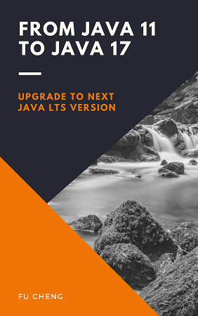

# From Java 11 to Java 17

This repo contains source code of my
book [From Java 11 to Java 17](https://leanpub.com/java11to17).

Java 17 is the next LTS version of Java. LTS means long-term support. Java 17
should be the next version to upgrade. It is expected that users of Java 11 will
gradually migrate to Java 17.

## The Book

This book covers major changes from Java 11 to Java 17. Below is a list of these
features:

* Records
* Sealed classes
* Switch expressions
* Pattern matching
* Text blocks
* JFR event streaming, JVM constants API, hidden classes
* Changes to Java standard libraries
* New garbage collectors
* Changes to JVM
* Packaging tool - `jpackage`
* Foreign function & memory API
* Other changes

If you are using Java 11 and planning to upgrade to Java 17, this book can
provide you with a valuable reference.

The minimal price of this book is $7.99.

## Get Java 17

You can get Eclipse Temurin JDK 17 builds from [Adoptium](https://adoptium.net/)
.

You can also use tools like [SDKMAN!](https://sdkman.io/) to install JDK 17 from
other distributors.
